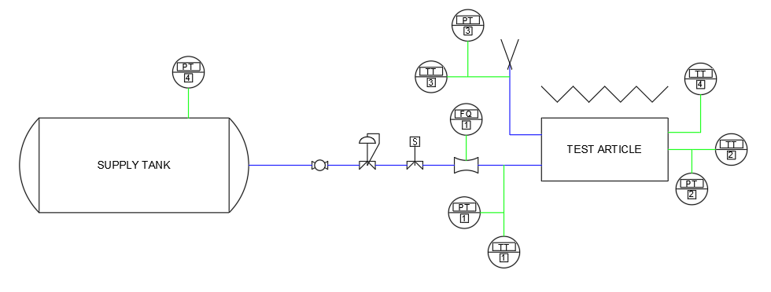

# Overview of the Test Facility's Design

## Configuration
The test stand is configured primarily to investigate the performance of tie tubes, control systems, heat exchangers, and related components in NTP systems. It enables these investigations by heating a test article while supplying gas. Software and sensors measure the flow characteristics to allow researchers to calculate heat transfer.

A list of instruments, components, and other items, with their data shees, is available [here](datasheets.md).

## [Hardware](hardware.md)
The test stand is comprised of a 30-gallon tank connected to a series of pressure regulating and mass flow controlling components. A 520 W heater is installed to supply heat to a test article, and the fluid systems control the cooling of the test artile.

||
|:-:|
|Test Stand P&ID|

## [Software and Instrumentation](software.md)
The software for the test stand is written in Python and Arduino (C++) and is hosted on [GitHub](https://github.com/gulanr/ntp). Instruments currently installed measure:
- Fluid mass flow rate
- Fluid temperature (x4)
- Fluid pressure (x4)
- Heater power (via current)

And users are able to control mass flow rate via a proportional solenoid valve and the heater power via PWM output.

||
|:-:|
|Software Control Loop|