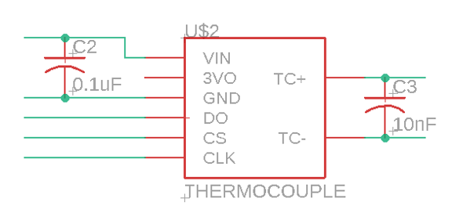
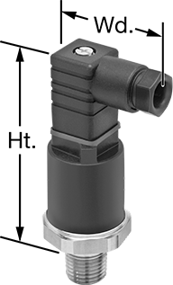
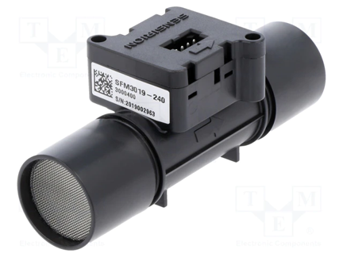
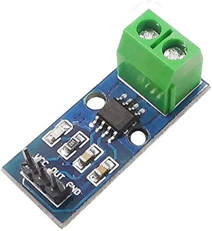
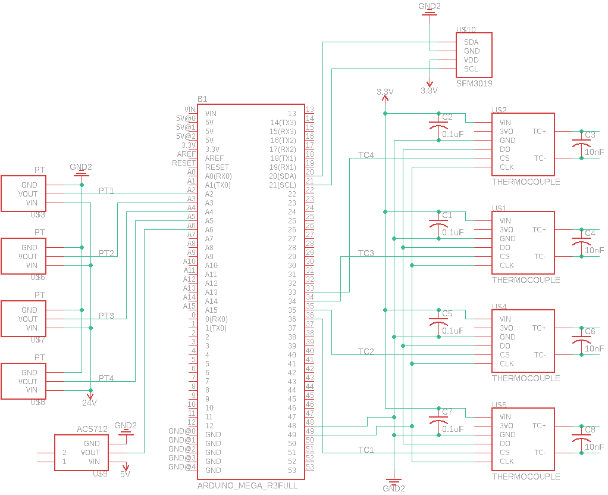
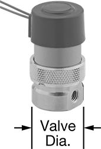
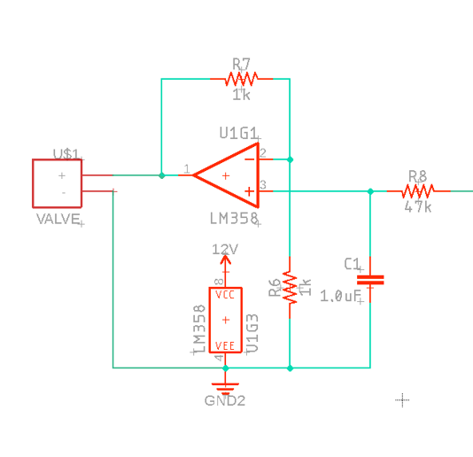
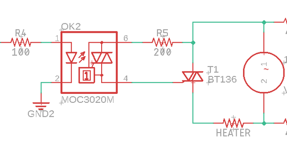
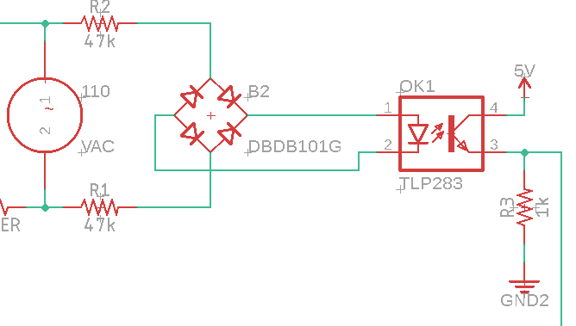
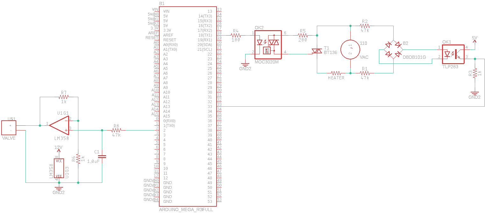

<script type="text/javascript" async
  src="https://cdn.mathjax.org/mathjax/latest/MathJax.js?config=TeX-MML-AM_CHTML">
</script>

# Instrumentation

<details open markdown="block">
  <summary>
    Table of contents
  </summary>
  {: .text-delta}
1. TOC
{: toc}

</details>


## Firmware

The test stand takes advantage of the affordability and adaptability of the Arduino ecosystem. Both the data acquisition and instrumentation control systems are implemented via [Arduino Mega 2560](https://store-usa.arduino.cc/products/arduino-mega-2560-rev3?selectedStore=us). The test stand software communicates with these systems via serial (USB) ports. Therefore, there are two sets of firmwares, one for the Data Acquisition System (DAS) and one for the Instrumentation Control System (ICS). Each are written in Arduino (C++) and handle command parsing, sensor polling, and signal processing.

## Data Acquisition System (DAS)

The test stand data acquisition makes use of an Arduino Mega 2560 to collect measurements from a variety of sensors and communicate that information to the test stand software via serial interface. The communication protocol is defined via software.

### Components

The test stand has the capability of measuring fluid pressure, temperature, and mass flow rate, as well as AC electrical current. Details on each of these components is provided below.

#### Thermocouples

[Type K thermocouples](../../assets/datasheets/JMTSS.pdf) are used to measure the flow temperature at several locations. Flow temperature is measured upstream of the test article, at the mid-point of the test article, and downstream of the test article. The temperature of the heat sink is also take for safety limits. Each of the four thermocouples are ungrounded MGO probes with a 1/8 in. SS 304 sheath.

To perform temperature measurement, [MAX31855](../../assets/datasheets/MAX31855.pdf) chips are used. These chips are 14-bit analog to digital converters which communicate via read-only SPI. A 0.1 uF capacitor is placed between VIN and GND on each chip to filter the input, and a 10 nF capacitor is placed between the thermocouple leads to filter out noise. Each of the chips share the DO (data output) and CLK (clock) lines, but each is assigned its own CS (chip select) line. Example Arduino firmware may be found [here](https://github.com/Zanduino/MAX31855/blob/master/examples/Demo/Demo.ino).

||
|:-:|
|Thermocouple Module|

<details>
    <summary>Expand code example</summary>

    ```cpp
    #include "MAX31855.h"  // Include MAX31855 Sensor library

    const uint32_t SERIAL_SPEED{115200};   ///< Set the baud rate for Serial I/O
    const uint8_t  SPI_CHIP_SELECT{2};     ///< Chip-Select PIN for SPI
    const uint8_t  SPI_MISO{MISO};         ///< Master-In, Slave-Out PIN for SPI
    const uint8_t  SPI_SYSTEM_CLOCK{SCK};  ///< System Clock PIN for SPI

    MAX31855_Class MAX31855;  ///< Create an instance of MAX31855

    void setup() {
    /*!
        @brief    Arduino method called once at startup to initialize the system
        @details  This is an Arduino IDE method which is called first upon boot or restart. It is only
                called one time and then control goes to the main "loop()" method, from which control
                never returns
        @return   void
    */
    Serial.begin(SERIAL_SPEED);
    #ifdef __AVR_ATmega32U4__  // If a 32U4 then wait 3 seconds for the interface to initialize
    delay(3000);
    #endif
    Serial.println(F("Starting software SPI demo program for MAX31855"));
    Serial.print(F("Initializing MAX31855 sensor\n"));
    
    while (!MAX31855.begin(SPI_CHIP_SELECT))  // Hardware SPI for MAX31855
    {
        Serial.println(F("Unable to start MAX31855. Waiting 3 seconds."));
        delay(3000);
    }  // of loop until device is located
    Serial.println();
    }  // of method setup()

    void loop() {
    int32_t ambientTemperature = MAX31855.readAmbient();  // retrieve MAX31855 die ambient temperature
    int32_t probeTemperature   = MAX31855.readProbe();    // retrieve thermocouple probe temp
    uint8_t faultCode          = MAX31855.fault();        // retrieve any error codes
    if (faultCode)                                        // Display error code if present
    {
        if (faultCode & B001) {
        Serial.println(F("Fault: Wire not connected"));
        }
        if (faultCode & B010) {
        Serial.println(F("Fault: Short-circuited to Ground (negative)"));
        }
        if (faultCode & B100) {
        Serial.println(F("Fault: Short-circuited to VCC (positive)"));
        }
    } else {
        // clang-format off
        Serial.print("Ambient Temperature is ");
        Serial.print((float)ambientTemperature / 1000, 3);
        Serial.println("\xC2\xB0""C");
        Serial.print("Probe Temperature is   ");
        Serial.print((float)probeTemperature / 1000, 3);
        Serial.println("\xC2\xB0""C\n");
        // clang-format on
    }  // of if-then-else an error occurred
    delay(5000);
    }  // of method loop()
    ```
</details>

#### Pressure Transducers

The pressure transducers used in the experiment are analog sensors which output a 0-10 VDC signal linearly correlated to a 0-200 psig range. These pressure transducers require a 14-36 VDC excitation, though, the instrumentation configuration here supplies a 24 VDC supply precisely. The 10-bit resolution of the Arduino Mega 2560's built-in analog-to-digital converter is sufficient for this test stand as it can resolve 0.488 psig change in pressure. Although the analog input of the Arduino is 5 VDC while the pressure transducers output 10 VDC full range, the pressures experienced during testing will remain below 100 psig, meaning the pressure transducers will never output more than 5 VDC.

To convert from voltage to pressure, the following relation is used.

$$ p = V\cdot\frac{100\ \text{psig}}{5\ \text{Volts}}\tag{1}$$ 

The pressure transducers have their excitation lines tied together at 24 VDC, grounds tied together, and each instrument uses an analog pin for its signal line.

||
|:-:|
|Pressure Transducer|

#### Mass Flow Meter

The test stand utilizes a cost effective [Sensiron mass flow meter](../../assets/datasheets/Sensirion_Mass_Flow_Meters_SFM3019_Datasheet.pdf) which is a digital flow meter with a range up to 240 slm with a low pressure drop across the sensor. It communicates via I<sup>2</sup>C with the Arduino.

The [Sensiron GitHub repository](https://github.com/Sensirion/embedded-sfm/tree/master/sfm3019) provides an example Arduino implementation to operate the sensor.

||
|:-:|
|Mass Flow Sensor|

#### Current Sensor

To measure the power supplied by the heater, an ACS712 current sensor is used. This Hall effect-based linear current sensor has a range of 5 Amps and produces an analog voltage between 0-5 VDC proportional to the measured current.

Using the 10-bit analog-to-digital converter on the Arduino Mega, the sensor can resolve a 5 mA change in current. Assuming the mains AC voltage supplied is a constant 120 VAC, the power supplied by the heater is calculated via Joule heating:

$$ P = IV$$

||
|:-:|
|Current Sensor|

```cpp
float current_sensitivity = 0.185; // [A/V] Sensitivity of ACS712 sensor
int current_sensor_pin = A2; // Pin location of ACS712

void loop() {
    // Read measurement from ACS712
    float current_measurement = analogRead(current_sensor_pin)*(5.0/1023.0);
    // Convert measurement to amps
    float current_value = (current_measurement - 2.5)/current_sensitivity;
}
```

### Wiring Diagram

||
|:-:|
|Data Acquisition System Schematic|

___

## Instrumentation Control System (ICS)

### Components

#### Mass Flow Control Valve

||
|:-:|
|Proportional Solenoid Valve|

||
|:-:|
|Valve Driver|

#### Heater Control Circuit

||
|:-:|
|Heater Relay Circuit|

||
|:-:|
|AC Signal Detector|

### Wiring Diagram

||
|:-:|
|Instrumentation Control System Schematic|
