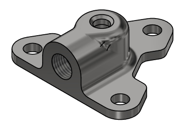

# Hardware Drawings
The following components have drawings made following ASME Y14.5M-2009 GD&T standards. A full CAD package of the test stand may be obtained by [contacting Noah Gula](mailto:gula.8@osu.edu).

|Image|Title|Part Number|Drawing|
|:-:|-|-|-|
||Manifold|1101-06.0|[1101-06.0 - Manifold.pdf](../../../assets/drawings/1101-06.0%20-%20Manifold.pdf)|
||Cap|1101-05.0|[1101-05.0 - Cap.pdf](drawings/1101-05.0%20-%20Cap.pdf)
||Inner Tie Tube|1101-04.0|[1101-04.0 - Inner Tie Tube.pdf](../../../assets/drawings/1101-04.0%20-%20Inner%20Tie%20Tube.pdf)|
||Heat Sink Conductor|1102-01.0|[1102-01.0 - Heat Sink Conductor.pdf](../../../assets/drawings/1102-01.0%20-%20Heat%20Sink%20Conductor.pdf)|
||Heat Sink Beam|1102-02.0|[1102-02.0 - Heat Sink Beam.pdf](../../../assets/drawings/1102-02.0%20-%20Heat%20Sink%20Beam.pdf)|